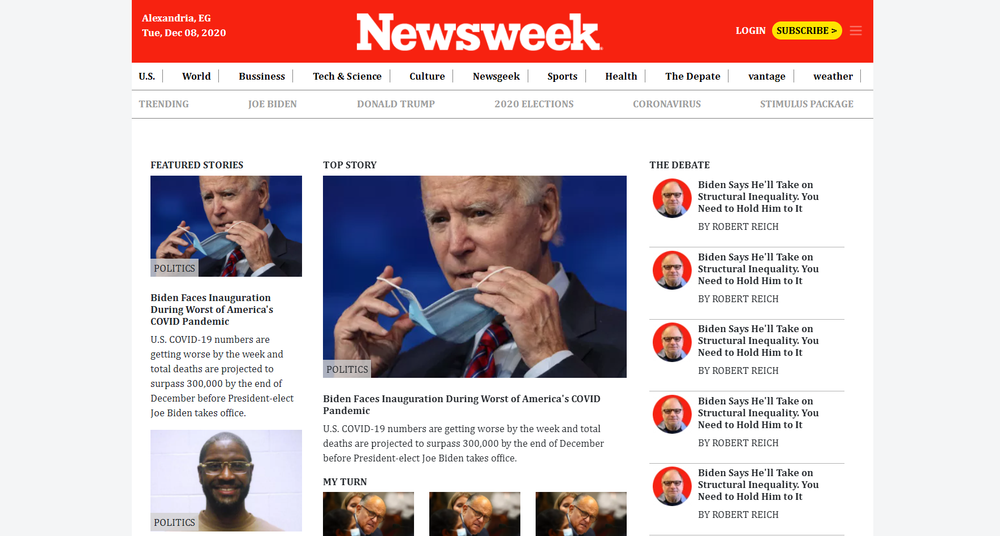
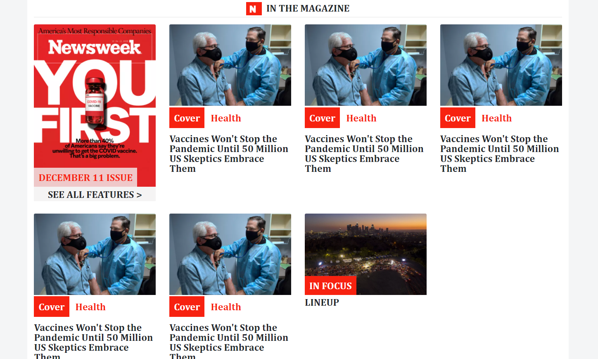
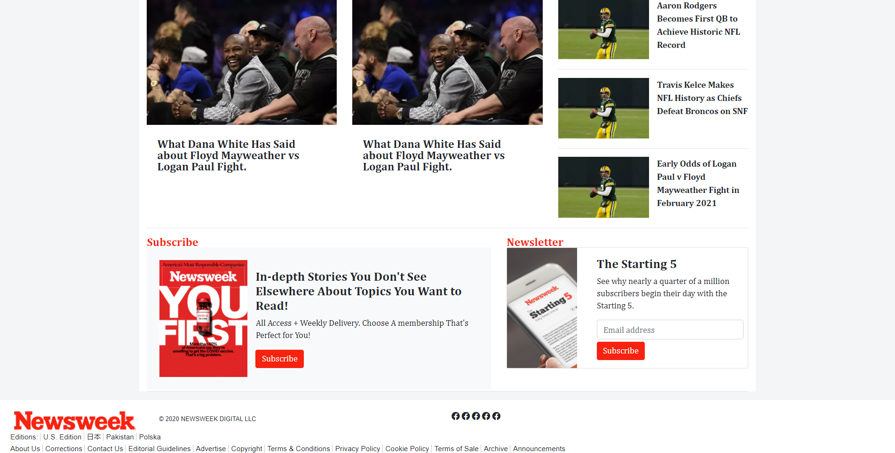

# TNW - Newsweek - Bootstrap Responsive design

> Sneak Peak - Project 3 .. cloning Newsweek homepage.

Additional description about the project and its features.

## Built With

- HTML
- CSS
- BOOTSTRAP

Built with CSS responsive techniques as "Flex, Grid, MediaQueries, Bootstrap"\

## Usage

git clone https://github.com/Mohamed-js/News-week.git

cd News-week

open index.html

## Live Demo

[Live Demo Link](https://Mohamed-js.github.io/News-week/)

## Authors

👤 **Mohammed Atef**

- GitHub: [Mohammed Atef](https://github.com/Mohamed-js)
- Twitter: [@MohammedAtef](https://twitter.com/Demovejetta)
- LinkedIn: [LinkedIn](https://www.linkedin.com/in/mohamed-atef-032b6b1b0/)

👤 **John hernandez**

- GitHub: [johnhernandez-code](https://github.com/johnhernandez-code)
- Twitter: [@JohnHernCode](https://twitter.com/JohnHernCode)
- LinkedIn: [LinkedIn](https://www.linkedin.com/in/john-hernandez-56a7821b8/)

## 🤝 Contributing

Contributions, issues, and feature requests are welcome!

## Show your support

Give a ⭐️ if you like this project!

## Acknowledgments

Thanks for the both parties involved in the development of this project.

## 📝 License

This project is [MIT](https://github.com/Mohamed-js/News-week/blob/dev-branch/LICENSE) licensed.
